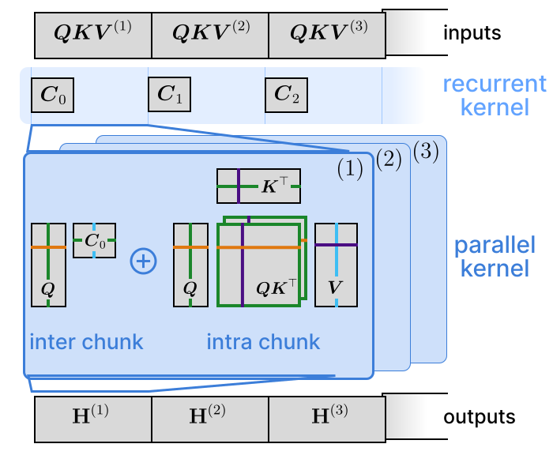
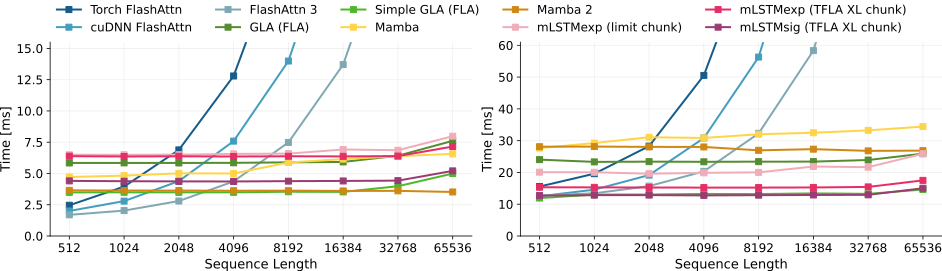

# Tiled Flash Linear Attention - mLSTM Kernels

 

>Paper: [https://arxiv.org/abs/2503.14376](https://arxiv.org/abs/2503.14376)
>
>Authors: Maximilian Beck, Korbinian Pöppel, Phillip Lippe, Sepp Hochreiter


## About
This library provides fast and efficient mLSTM training and inference Triton kernels.
The chunkwise-parallel mLSTM Kernels are built on Tiled Flash Linear Attention (TFLA).

This repository also contains an easy to extend library for any kind of runtime benchmarks, which we use to benchmark our mLSTM kernels, as well as full mLSTM Huggingface models.

## mLSTM Kernel Library Overview

At its core the mLSTM Kernel library contains several implementations of the mLSTM in JAX, PyTorch as well as kernels in Triton,
which build three toplevel modules within the `mlstm_kernels` library:

- `jax`: Contains JAX native implementations of the mLSTM, as well as JAX Triton integrations.
- `torch`: Contains PyTorch native implementations of the mLSTM, as well the Triton integrations for PyTorch. It also contains the configurable PyTorch backend module for simple integration of the mLSTM kernels into your models (see below for further details).
- `triton`: Contains the Triton kernels for the mLSTM, as well as kernel launch parameter heuristics.

The `utils` module contains code for unit tests, additional analysis (such as the transfer behavior analysis from the TFLA paper) or the benchmark library, which is discussed in detail below.

Each of the three toplevel modules, contains three different types of implementations and kernels for the mLSTM:

- `chunkwise`: Chunkwise kernels, that process chunks of the sequence in parallel. These include the TFLA kernels.
- `parallel`: Parallel kernels that process a sequence in parallel (like Attention). Overall the runtime of these kernels scales quadratically with sequence length.
- `recurrent`: Recurrent step kernels for text generation during inference.

## Benchmark of TFLA mLSTM kernels

Runtime comparison of mLSTM chunkwise kernels against other baselines on a NVIDA H100 GPU with a constant number of tokens.
This means that as we increase the sequence length on the x-axis we proportionally decrease the batch size to keep the overall number of tokens constant. This is the same setup as for example in FlashAttention 3.



**Left**: Forward pass
**Right**: Forward and backward pass

### Kernel description

We benchmark the two mLSTM versions: mLSTM with exponential input gate (mLSTMexp) and mLSTM with sigmoid input gate (mLSTMsig)

- **mLSTMexp (limit chunk)**: mLSTMexp kernel with limited chunk size (`chunk_size=64`).
- **mLSTMexp (TFLA XL chunk)**: mLSTMexp TFLA kernel with unlimited chunk size (in this benchmark `chunk_size=128`)
- **mLSTMsig (TFLA XL chunk)**: mLSTMsig TFLA kernel with unlimited chunk size (in this benchmark `chunk_size=128`)

> In the following `limit_chunk` means chunkwise kernels that are limited in chunk_size and `xl_chunk` means TFLA kernels.

For more details we refer to the TFLA paper.


## Installation

You can find the conda environment file in the `envs/` folder. We recommend to use the latest file, i.e. `environment_pt251cu124.yaml`

Then you can install the mLSTM kernels via pip: `pip install mlstm_kernels`
or by cloning the repository.


## How to use and integrate our mLSTM kernels

In this library we proivide PyTorch, JAX and Triton implementations of the mLSTM.
For the Triton kernels, we provide wrappers in PyTorch and JAX.

There are two options to use our implementations and kernels:

### Option 1 (Recommended): Use via backend module
This is the recommended option, if you want to use our mLSTM kernels in your own (language) model.
The backend module is implemented in `mlstm_kernels/torch/backend_module.py` and provides a configurable wrapper around all our mLSTM implementations and kernels.

>Note: This is also how these kernels are implemented in our official implementation for the xLSTM 7B model (see [xLSTM 7B model.py](https://github.com/NX-AI/xlstm/blob/main/xlstm/xlstm_large/model.py))

It allows to switch between training and inference mode and automatically selects the respective kernels.

For example the following code snippet configures the `mLSTMBackend` to use our TFLA mLSTMexp kernel:

```python
# we use the mLSTMexp TFLA kernel
# we also configure to use the triton step kernel for inference
mlstm_backend_config = mLSTMBackendConfig(
    chunkwise_kernel="chunkwise--triton_xl_chunk",
    sequence_kernel="native_sequence__triton",
    step_kernel="triton",
    chunk_size=256,
    return_last_states=False,
)

mlstm_backend = mLSTMBackend(mlstm_backend_config)

# run the backend
DEVICE = torch.device("cuda")
DTYPE = torch.bfloat16
B = 2
S = 512
DHQK = 128
DHHV = 256
NH = 4

# create input tensors
torch.manual_seed(1)
matQ = torch.randn((B, NH, S, DHQK), dtype=DTYPE, device=DEVICE)
matK = torch.randn((B, NH, S, DHQK), dtype=DTYPE, device=DEVICE)
matV = torch.randn((B, NH, S, DHHV), dtype=DTYPE, device=DEVICE)
vecI = torch.randn((B, NH, S), dtype=DTYPE, device=DEVICE)
vecF = 3.0 + torch.randn((B, NH, S), dtype=DTYPE, device=DEVICE)

matH = mlstm_backend(q=matQ, k=matK, v=matV, i=vecI, f=vecF)
```

**Quickstart**: Have a look at the demo notebook `demo/integrate_mlstm_via_backend_module_option1.ipynb`.


### Option 2: Direct import

If you directly want to use a specific kernel you can directly import the kernel from the respective module.
The following code snippet import the TFLA mLSTMexp kernel and runs a forward pass.

```python
import torch
# directly import mLSTMexp TFLA kernel
from mlstm_kernels.torch.chunkwise.triton_xl_chunk import mlstm_chunkwise__xl_chunk

# run the kernel
DEVICE = torch.device("cuda")
DTYPE = torch.bfloat16
B = 2
S = 512
DHQK = 128
DHHV = 256
NH = 4

torch.manual_seed(1)
matQ = torch.randn((B, NH, S, DHQK), dtype=DTYPE, device=DEVICE)
matK = torch.randn((B, NH, S, DHQK), dtype=DTYPE, device=DEVICE)
matV = torch.randn((B, NH, S, DHHV), dtype=DTYPE, device=DEVICE)
vecI = torch.randn((B, NH, S), dtype=DTYPE, device=DEVICE)
vecF = 3.0 + torch.randn((B, NH, S), dtype=DTYPE, device=DEVICE)

matH1 = mlstm_chunkwise__xl_chunk(
    q=matQ, k=matK, v=matV, i=vecI, f=vecF, return_last_states=False, chunk_size=256
)
```

### Option 3: Select the kernel via the kernel specifier

You can also get a specific kernel function via its kernel specifier.

First, display all available kernels via `get_available_mlstm_kernels()`.
This displays all kernels that can be used for training and that have a similar function signature such that they can be used interchangably.

```python
# display all available mlstm chunkwise and parallel kernels
from mlstm_kernels.torch import get_available_mlstm_kernels

get_available_mlstm_kernels()
```
```
['chunkwise--native_autograd',
 'chunkwise--native_custbw',
 'chunkwise--triton_limit_chunk',
 'chunkwise--triton_xl_chunk',
 'chunkwise--triton_xl_chunk_siging',
 'parallel--native_autograd',
 'parallel--native_custbw',
 'parallel--native_stablef_autograd',
 'parallel--native_stablef_custbw',
 'parallel--triton_limit_headdim',
 'parallel--native_siging_autograd',
 'parallel--native_siging_custbw']
```

Then select a kernel via `get_mlstm_kernel()`:

```python
# select the kernel
from mlstm_kernels.torch import get_mlstm_kernel

mlstm_chunkwise_xl_chunk = get_mlstm_kernel("chunkwise--triton_xl_chunk")

matH2 = mlstm_chunkwise_xl_chunk(
    q=matQ, k=matK, v=matV, i=vecI, f=vecF, return_last_states=False, chunk_size=256
)

torch.allclose(matH1, matH2, atol=1e-3, rtol=1e-3) # True
```

**Quickstart for option 2 and 3**: Have a look at the demo notebook `demo/integrate_mlstm_via_direct_import_option2and3.ipynb`.


### Using the JAX wrappers

The JAX module `mlstm_kernels.jax` mirrors the PyTorch module `mlstm_kernels.torch` and can be used in the way as the PyTorch kernels with option 2.

<!-- We also aim provide a backend module for Flax soon. -->

## Benchmark Library

The module `mlstm_kernels.utils.benchmark` contains a configurable benchmark library for benchmarking the runtime and GPU memory usage of kernels or models.
We use this library for all our benchmarks in the TFLA paper and the xLSTM 7B paper.

### Overview

**Step 1:** To begin please have a look at `mlstm_kernels/utils/benchmark/benchmarks/interface.py`

At the core of the benchmark library, there is the `BenchmarkInterface` dataclass, which is the abstract base class that every new benchmark should inherit from.
The `BenchmarkInterface` dataclass holds generic benchmark parameters, defines the `setup_benchmark` function that must be overridden for every specific benchmark and also defines the function to benchmark `benchmark_fn`, which is the function that is benchmarked.
To run the benchmark the `BenchmarkInterface` has the method `run_benchmark`.

The `BenchmarkCreator` defines the benchmark collection, i.e. the collection of benchmarks that can be run and configured together via a single config.
To create a new benchmark collection, with several benchmarks one has to implement a new `BenchmarkCreator`.
This is a function that takes as input a `KernelSpec` dataclass (containing the specification for the benchmark class) and a parameter dict with overrides. It then creates and returns the specified benchmark.

**Step 2:** Next have a look at `mlstm_kernels/utils/benchmark/param_handling.py` in order to understand how the benchmarks are configured through a unified config.

We use the dataclass `KernelSpec` to provide a unified interface to our kernel benchmarks. The `kernel_name` must be a unique specifier within a benchmark collection. The `additional_params` field are parameters that are overriden in the respective `BenchmarkInterface` class.

One level above is the `BenchmarkConfig` dataclass. This config class enables to configure sweeps over multiple `KernelSpec` dataclasses.

**Step 3:** Finally, have a look at `mlstm_kernels/utils/benchmark/run_benchmark.py` and a corresponding benchmark script, e.g. `scripts/run_training_kernel_benchmarks.py`.

The "benchmark loops" are implemented in `run_benchmark.py`. These take as input a `BenchmarkConfig` and a `BenchmarkCreator` and run every benchmark member specified in the kernel specs with every parameter combination.

The `run_and_record_benchmarks()` functions executes these loops, and records the results to disk via .csv files and plots.

Finally, in our case we create scripts that collect several configured benchmarks, which we can then run via different arguments, see for e.g. `scripts/run_training_kernel_benchmarks.py`.

You should now be able to understand the structure of our benchmark suites, i.e. collections of benchmarks that are run together.
In this repository we create several benchmark suites, for example the kernel benchmarks for the TFLA paper or the model benchmarks for the xLSTM 7B paper.
These are implemented in `mlstm_kernels/utils/benchmark/benchmarks/training_kernel_benchmarks.py` and `mlstm_kernels/utils/benchmark/benchmarks/huggingface_model_benchmark.py`, respectively.

**Quickstart:** For a quick start please have a look at the demo notebook: `demo/kernel_speed_benchmark.ipynb`.

### Running kernel benchmarks

The following command runs the mLSTM kernels from the figure above.
Note that you need a large GPU memory in order to fit the long sequences and large embedding dimension of 4096 for a 7B model.

``` bash
PYTHONPATH=. python scripts/run_training_kernel_benchmarks.py --consttoken_benchmark mlstm_triton --folder_suffix "mlstm_bench" --num_heads 16 --half_qkdim 1
```

It will create a new subfolder in `outputs_kernel_benchmarks/` that contains the results.

## Running the unit tests

The unit tests cross-check the different kernel implementations on numerical deviations for different dtypes.
You can run all of them with the following command:

```bash
pytest -s tests/torch
# make sure you are in a JAX GPU environment
pytest -s tests/jax
```

The `-s` disables the log capturing so you see the results directly on the command line.
Each test will log the outputs to a new folder with the timestamp as name in the `test_outputs/` directory.

Note: The the JAX tests were only tested on NVIDIA H100 GPUs.

## Citation

Please cite our papers if you use this codebase, or otherwise find our work valuable:

```
@article{beck:25tfla,
  title        = {{Tiled Flash Linear Attention}: More Efficient Linear RNN and xLSTM Kernels},
  author       = {Maximilian Beck and Korbinian Pöppel and Phillip Lippe and Sepp Hochreiter},
  year         = {2025},
  volume       = {2503.14376},
  journal      = {arXiv},
  primaryclass = {cs.LG},
  url          = {https://arxiv.org/abs/2503.14376}
}

@article{beck:25xlstm7b,
  title        = {{xLSTM 7B}: A Recurrent LLM for Fast and Efficient Inference},
  author       = {Maximilian Beck and Korbinian Pöppel and Phillip Lippe and Richard Kurle and Patrick M. Blies and Günter Klambauer and Sebastian Böck and Sepp Hochreiter},
  year         = {2025},
  volume       = {2503.13427},
  journal      = {arXiv},
  primaryclass = {cs.LG},
  url          = {https://arxiv.org/abs/2503.13427}
}

@inproceedings{beck:24xlstm,
      title={xLSTM: Extended Long Short-Term Memory},
      author={Maximilian Beck and Korbinian Pöppel and Markus Spanring and Andreas Auer and Oleksandra Prudnikova and Michael Kopp and Günter Klambauer and Johannes Brandstetter and Sepp Hochreiter},
      booktitle = {Thirty-eighth Conference on Neural Information Processing Systems},
      year={2024},
      url={https://arxiv.org/abs/2405.04517},
}
```
