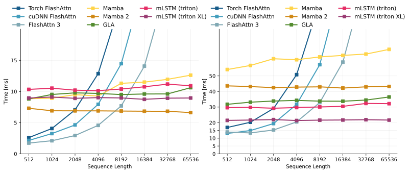

# mLSTM Kernels

This library provides fast and efficient mLSTM kernels for the parallel, recurrent and chunkwise form. We provide PyTorch and JAX wrappers for our kernels.

Paper coming soon! Stay tuned 📺🎧⏳✨

## Kernel Overview

This library contains three different types of kernels:

- `parallel`: Parallel kernels that process a sequence in parallel (like Attention).
- `chunkwise`: Chunkwise kernels, that process chunks of the sequence in parallel.
- `recurrent`: Recurrent step kernels for inference.

## Benchmark

Runtime comparison of mLSTM chunkwise kernel (triton) [`triton_limit_chunk`] and (triton XL) [`triton_xl_chunk`] against other baselines:



**Left**: Forward pass  
**Right**: Forward and backward pass


## Usage PyTorch

### Available Kernels

You can view all available kernels for the mLSTM by calling

```python
from mlstm_kernels.torch import (
    get_available_mlstm_kernels,
    get_available_mlstm_sequence_kernels,
    get_available_mlstm_step_kernels,
)

print(get_available_mlstm_kernels())
print(get_available_mlstm_sequence_kernels())
print(get_available_mlstm_step_kernels())
```

and then use one of 

```python
from mlstm_kernels.torch import (
    get_mlstm_kernel,
    get_mlstm_sequence_kernel,
    get_mlstm_step_kernel,
)
```
to access the specific kernel function.

### Direct Import

You can directly import the specific kernel for example the chunkwise `triton_limit_chunk` kernel via:

```python
from mlstm_kernels.torch.chunkwise import mlstm_chunkwise__limit_chunk
```

### Backend Module

For PyTorch we provide a backend module for an easy integration into existing architectures. 

```python
from mlstm_kernels.torch.backend_module import mLSTMBackendConfig, mLSTMBackend
```

### Training Kernel Interface 

This is the interface used for the chunkwise and parallel kernels.

```python
def mlstm_interface(
    q: torch.Tensor, # (B, NH, S, DHQK)
    k: torch.Tensor, # (B, NH, S, DHQK)
    v: torch.Tensor, # (B, NH, S, DHHV)
    i: torch.Tensor, # (B, NH, S)
    f: torch.Tensor, # (B, NH, S)
    c_initial: torch.Tensor = None, # (B, NH, DHQK, DHHV)
    n_initial: torch.Tensor = None, # (B, NH, DHQK)
    m_initial: torch.Tensor = None, # (B, NH, 1)
    return_last_states: bool = False,
    eps: float = 1e-6,
    autocast_kernel_dtype: torch.dtype = torch.bfloat16,
    chunk_size: int = 64,
    **kwargs,
) -> torch.Tensor | tuple[torch.Tensor, tuple[torch.Tensor, torch.Tensor, torch.Tensor]]:
    # (B, NH, S, DHHV) | ((B, NH, S, DHHV), ((B, NH, DHQK, DHHV), (B, NH, DHQK), (B, NH)))
    """
    Returns:
        torch.Tensor: matH outputs (no n and m values, no last states)
        tuple[torch.Tensor, tuple[torch.Tensor, torch.Tensor, torch.Tensor]]: matH, (matC_last, vecN_last, scaM_last)
    """
    pass

```

### Step Kernel interface

This is the interface for the mlstm step kernels.

```python
def mlstm_step_interface(
    q: torch.Tensor,  # (B, NH, DHQK)
    k: torch.Tensor,  # (B, NH, DHQK)
    v: torch.Tensor,  # (B, NH, DHHV)
    i: torch.Tensor,  # (B, NH, 1)
    f: torch.Tensor,  # (B, NH, 1)
    c: torch.Tensor,  # (B, NH, DHQK, DHHV)
    n: torch.Tensor,  # (B, NH, DHQK)
    m: torch.Tensor,  # (B, NH, 1)
    eps: float = 1e-6,
    **kwargs,
) -> tuple[
    torch.Tensor, tuple[torch.Tensor, torch.Tensor, torch.Tensor]
]:  # vecH, (matC_state_new (B, NH, DHQK, DHHV), vecN_state_new (B, NH, DHQK), vecM_state_new (B, NH, 1))
    pass
```

## Usage JAX

The JAX module `mlstm_kernels.jax` mirrors the PyTorch module `mlstm_kernels.torch` and can be used in the same way. 

We will also provide a backend module for Flax soon. 

## Running the unit tests

The unit tests cross-check the different kernel implementations on numerical deviations for different dtypes.
You can run all of them with the following command:

```bash
pytest -s tests/torch
# make sure you are in a JAX GPU environment
pytest -s tests/jax
```

The `-s` disables the log capturing so you see the results directly on the command line.
Each test will log the outputs to a new folder with the timestamp as name in the `test_outputs/` directory.

Example:
Each test starts with the line
`Test chunkwise-triton_xl_chunk target=triton_chunkwise_xl_chunk vs. baseline=native_parallel_stablef_custbw with S=256, B=1, NH=2, DHQK=64, DHHV=128, DTYPE=torch.float32`.

This test tests the chunkwise triton kernel `triton_chunkwise_xl_chunk` against the `native_parallel_stablef_custbw` baseline and runs the `triton_chunkwise_xl_chunk` in dtype float32. It will compare the errors against the baseline in the same dtype (i.e. float32 here) and in float64 if specified.

## Citation

Our paper is currently under preparation. We will announce it soon.
In the meantime if you use this codebase, or otherwise find our work valuable, please use this citations:

```
@article{beck:25unlocking,
  title={Unlocking the Power of Recurrence for Efficient xLSTM Kernels}, 
  author={Maximilian Beck and Korbinian Pöppel and Sepp Hochreiter},
  booktitle = {Under preparation},
  year={2025},
}
@software{beck:24mlstmkernels,
  title  = {mLSTM Kernels: A Library for Efficient mLSTM Kernels},
  author = {Maximilian Beck and Korbinian Pöppel and Phillip Lippe},
  url    = {https://github.com/NXAI/mlstm_kernels},
  month  = dec,
  year   = {2024}
}
```
